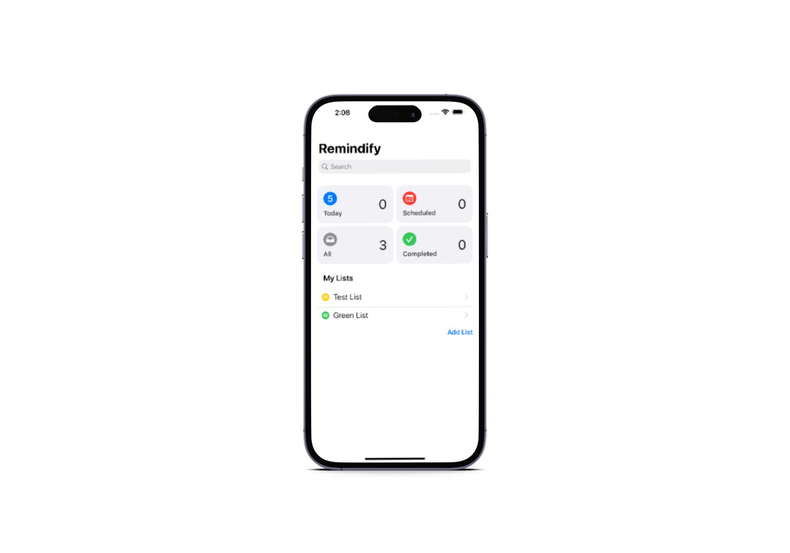

# Remindify

Remindify is an iOS reminder app that allows users to create, manage, and organize their tasks and reminders in one convenient place. With Remindify, users can easily set reminders for specific dates and times, create recurring reminders, and receive notifications when their tasks are due.

### Features

- Create tasks and reminders
- Set due dates and times
- Receive notifications when tasks are due
- Organize tasks by list
- Mark tasks as completed

### Installation

To install Remindify, follow these steps:

1. Clone the Remindify repository from GitHub onto your local machine.
2. Open the Remindify project in Xcode.
3. Connect your iOS device to your computer.
4. In Xcode, select your device as the build target.
5. Build and run the Remindify app on your iOS device.

Note: To build and run Remindify, you'll need to have Xcode installed on your Mac.

### Usage

To use Remindify, follow these steps:

1. Open the app.
2. Tap the "Add List" button to create a new list.
3. Enter a title and select a color for the list.
4. Tap the "New Reminder" button to create a new reminder.
5. Enter the title for the reminder.test
6. Tap "Done" to save the reminder.
7. Modify the title, notes, due date and time by click the "Info" button of each reminder.

To mark a reminder as complete, tap the "Complete" button.